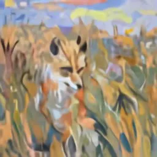
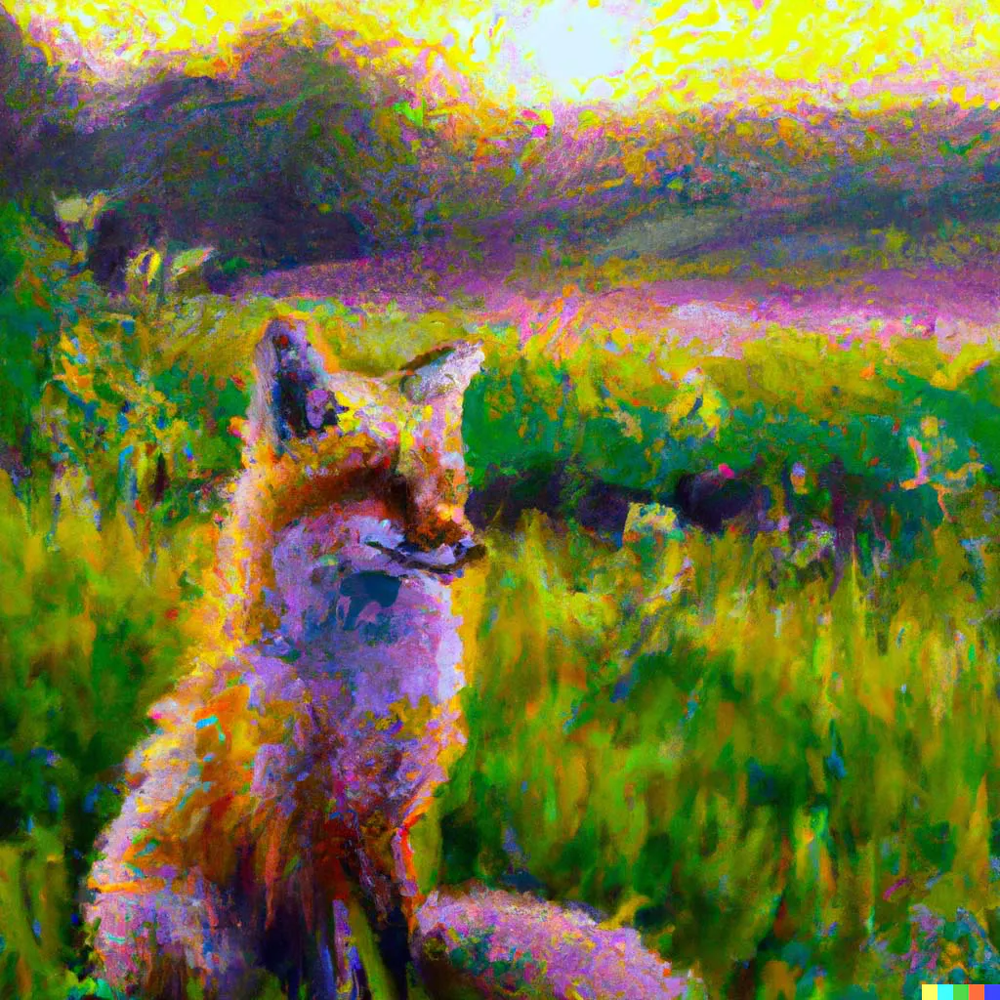
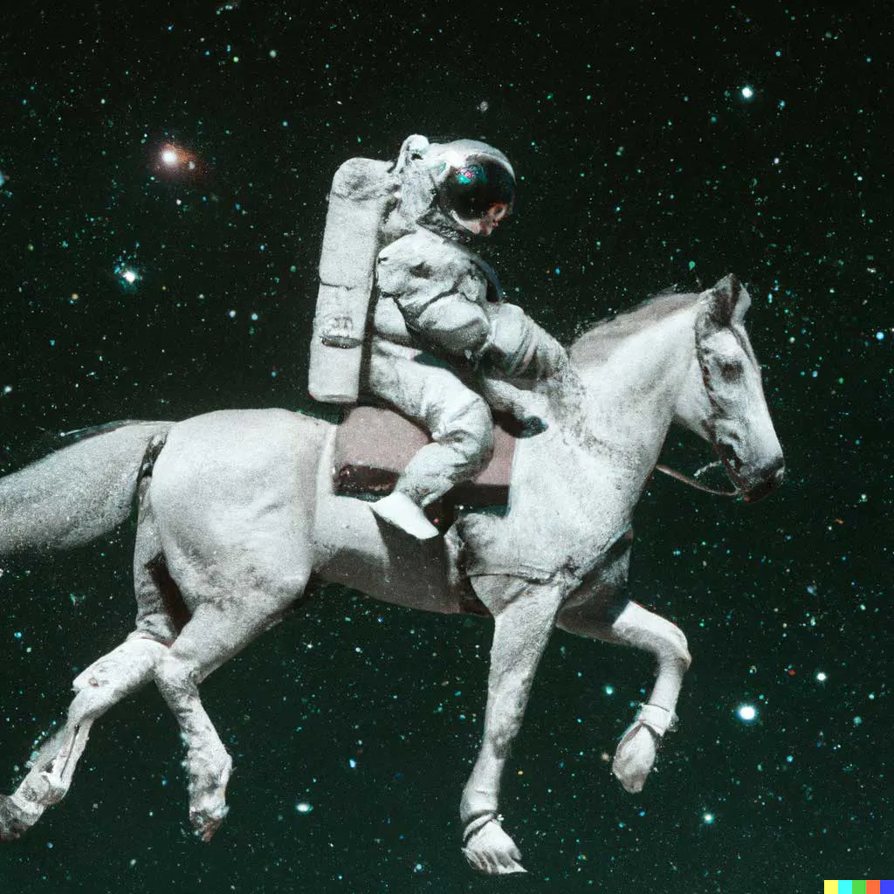
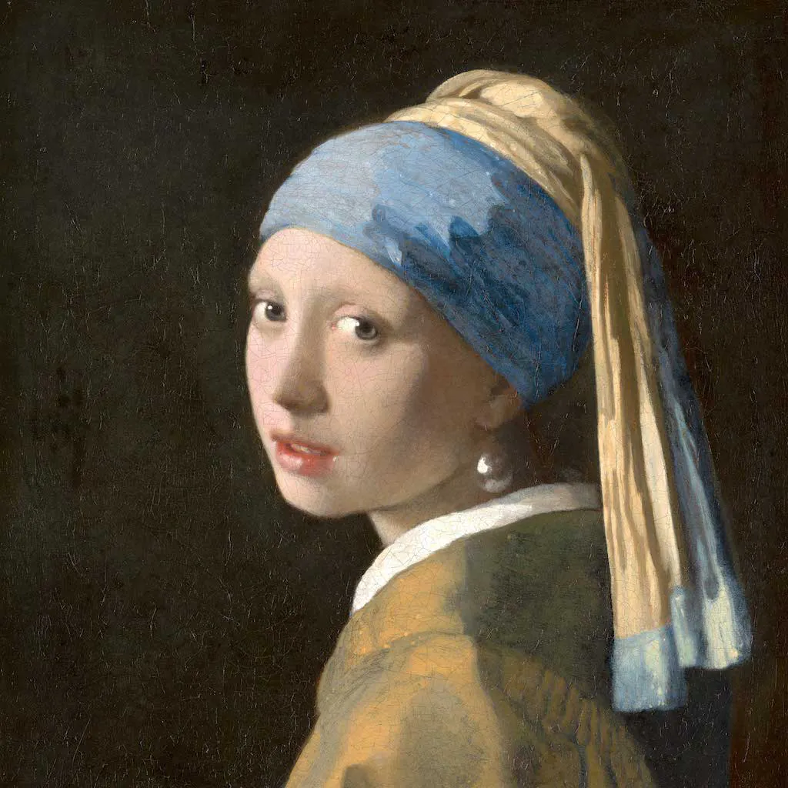
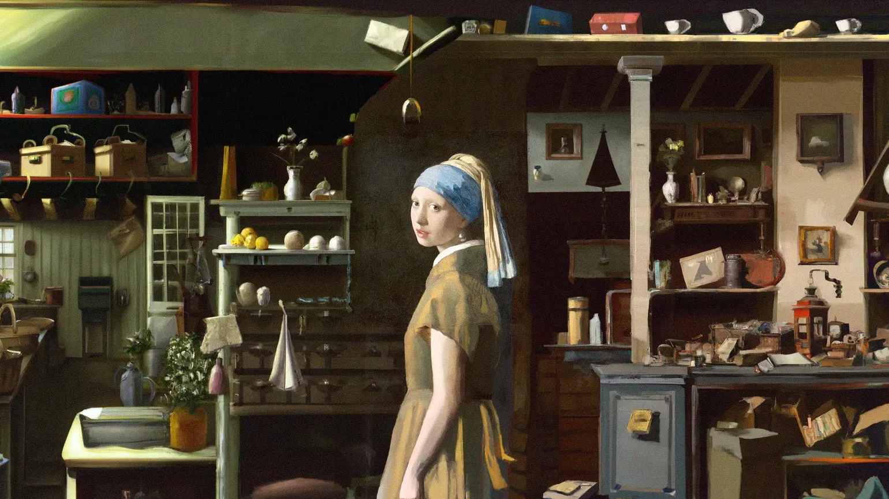
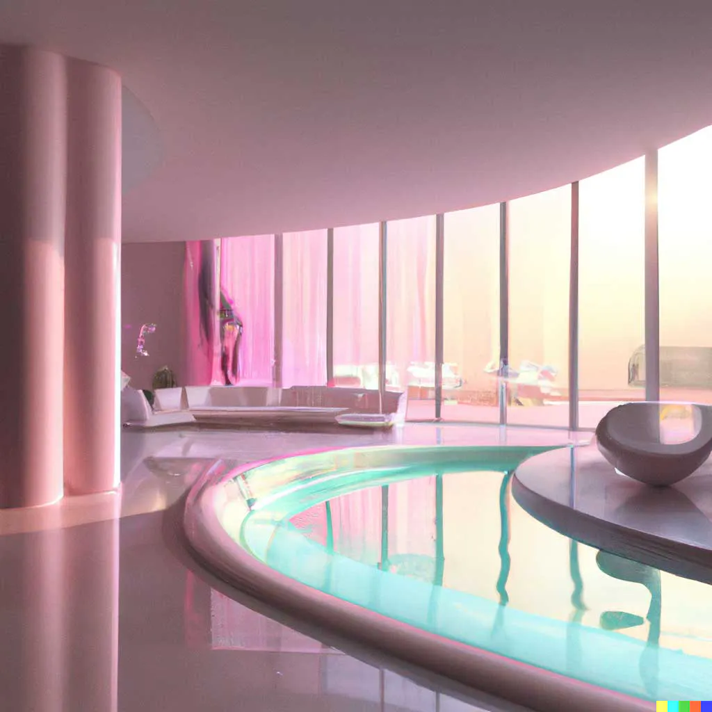
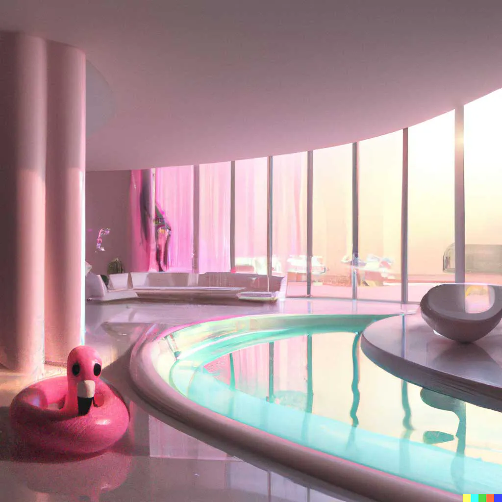
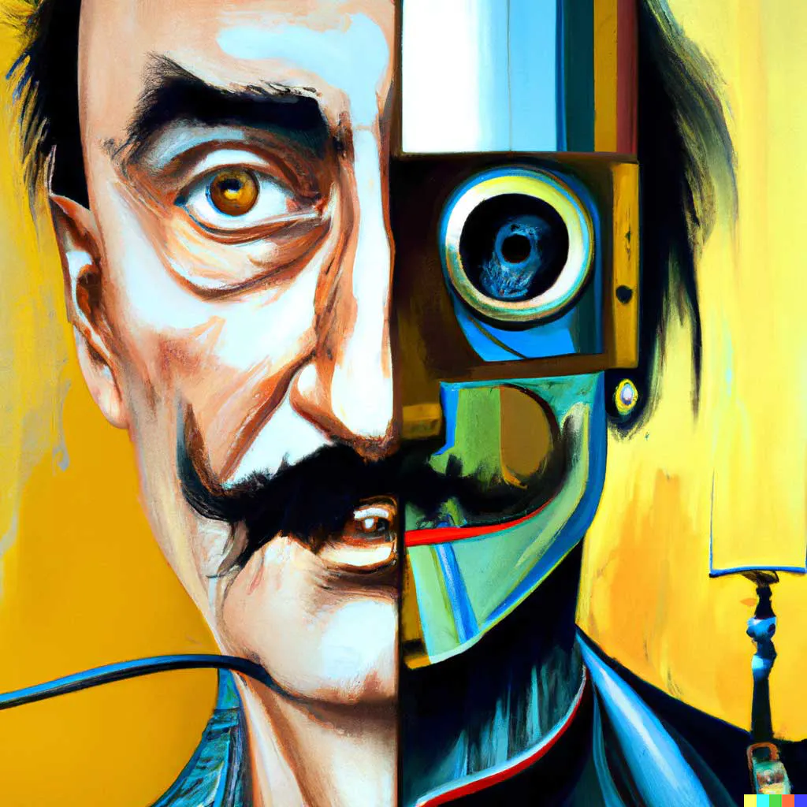
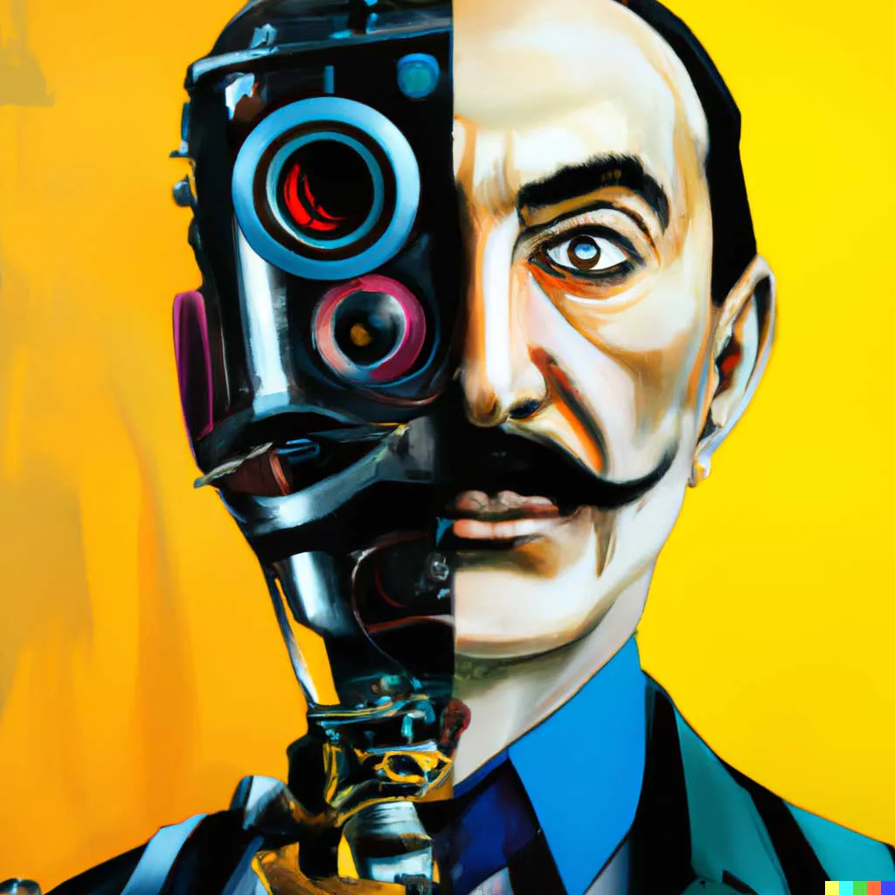
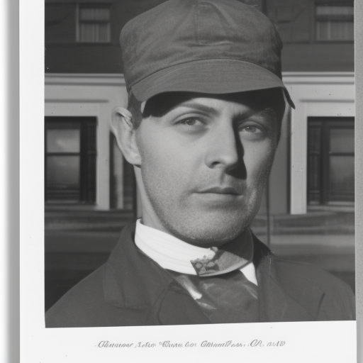

## Concurso IA
---
## ¿Quiénes somos?

## Alumnado
---
## Historia reciente de la generación de imágenes usando IA

## DALL·E

<small>OpenAI - Enero 2021</small>
---
## DALL·E 2

<small>OpenAI - Mayo 2022</small>

## Text to Image

<small>An astronaut riding a horse in photorealistic style</small>

## Outpainting

<small>Input</small>

<small>Output</small>

## Inpainting

<small>Input: Add a flamingo beside the pool</small>

<small>Output</small>

## Variations

<small>Input</small>

<small>Output</small>
---
## Stable Diffusion

<small>front photograph of poet, hq</small>

<small>StabilityAI - Agosto 2022</small>

## Open Source

<small>Modelos fine-tunning de Stable Diffusion</small>

## Dreambooth

## LoRA

## Stable Diffusion 2.1

<small>StabilityAI - Diciembre 2022</small>
---
## Midjourney

https://weirdwonderfulai.art/general/midjourney-versions-ai-evolution/

1	March 2022
2	April 2022[10]
3	July 25, 2022[11]
4	November 5, 2022 (alpha)[12]
5	March 16, 2023 (beta)[14]

## ControlNet

https://github.com/lllyasviel/ControlNet

Febrero 2023

## Adobe Firelfly

https://www.adobe.com/sensei/generative-ai/firefly.html

21 marzo 2023
---
## ¿Hacia dónde vamos?

## Point-e

## Gen-2
---
## El portal Hugging Face

## Datasets

## Models

## Spaces
---
## Demo Time!
--
## ¿Qué puedes crear?
---

<!-- .slide: data-background-video="../assets/searching.mp4" data-background-opacity="0.6" data-background-video-loop data-background-video-muted-->

## ¿Dudas?
