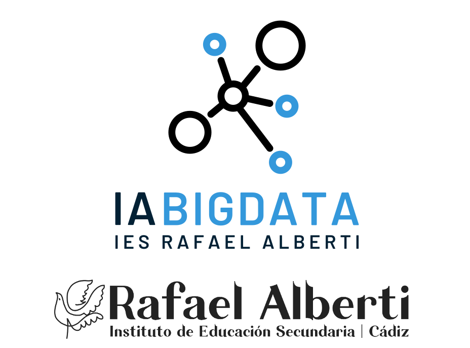

## Concurso IA
---
## ¿Quiénes somos?

## Alumnado
---
## Historia reciente de la generación de imágenes usando IA

## DALL·E

## DALL·E 2

## Stable Diffusion

## Midjourney

## Dreambooth y LoRA

## Pix2Pix y ControlNet
---
## Estado del arte

Vía comercial

Vía Open Source

## Hacia el futuro

Point-e

Gen-2

---
## El portal Hugging Face
---

<!-- .slide: data-background-video="../assets/searching.mp4" data-background-opacity="0.6" data-background-video-loop data-background-video-muted-->

## ¿Dudas?
