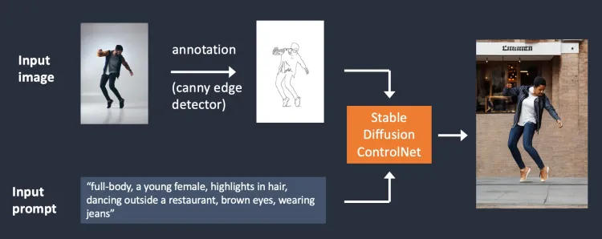

---
## ¿Quiénes somos?

## Alumnado
---
## Historia reciente de la generación de imágenes usando IA

---
## DALL·E

<small>OpenAI - Enero 2021</small>

## DALL·E 2

<small>OpenAI - Mayo 2022</small>

## Text to Image

<small>An astronaut riding a horse in photorealistic style</small>

## Outpainting

<small>Input</small>

<small>Output</small>

## Inpainting

<small>Input: Add a flamingo beside the pool</small>

<small>Output</small>

## Variations

<small>Input</small>

<small>Output</small>
---
## Stable Diffusion

<small>front photograph of poet, hq</small>

<small>StabilityAI - Agosto 2022</small>

## Open Source

<small>Modelos fine-tunning de Stable Diffusion</small>

## Dreambooth

<small>25 agosto 2022</small>

## Stable Diffusion 2.1

<small>StabilityAI - Diciembre 2022</small>
---
## Midjourney

## v1

<small>Marzo 2022</small> 

## v2

<small>Abril 2022</small>

## v3

<small>25 julio 2022</small>

## v4

<small>5 noviembre 2022</small>

## v5

<small>15 marzo 2023</small>

## People in v5

<small>¡Mira las manos!</small>
---
## ControlNet

<small>Febrero 2023</small>

## Canny Edge Maps

## Hough Lines Map

## HED Maps

## Scribble Maps

## Interactive Scribble Maps

## Fake Scribble Maps

## Human Pose

## Segmentation Maps

## Depth Maps

## Normal Maps

---
## Adobe Firelfly

<iframe width="560" height="315" src="https://www.youtube-nocookie.com/embed/_sJfNfMAQHw" title="YouTube video player" frameborder="0" allow="accelerometer; autoplay; clipboard-write; encrypted-media; gyroscope; picture-in-picture; web-share" allowfullscreen></iframe>

<small>21 marzo 2023</small>
---
## ¿Hacia dónde vamos?

## Todo sobre imagen a 3D

<video src="https://instruct-nerf2nerf.github.io/data/videos/face.mp4" width="512" height="384" controls></video>

<small>22 marzo 2023 - Instruct-NeRF2NeRF</small>

## Todo sobre imagen a vídeo

<video src="https://d3phaj0sisr2ct.cloudfront.net/research/Gen2.mp4" width="640" height="480" controls></video>

<small>6 febrero 2023 - Gen-2</small>
---
## El portal Hugging Face

## Datasets

## Models

## Spaces

---
## Demo Time!

---
## ¿Qué puedes crear?

## ¡Únete a la organización!

QR
---
## Algunos parámetros básicos

## Seed

## Negative Prompt

## Model

## Guidance Scale

## Number of steps

## Width and Height

## Number of Images

## Schedulers

## Upscale
---
## Accede a recursos

QR
---
## Envía tu mejor imagen

QR
---

<!-- .slide: data-background-video="../assets/searching.mp4" data-background-opacity="0.6" data-background-video-loop data-background-video-muted-->

## ¿Dudas?
